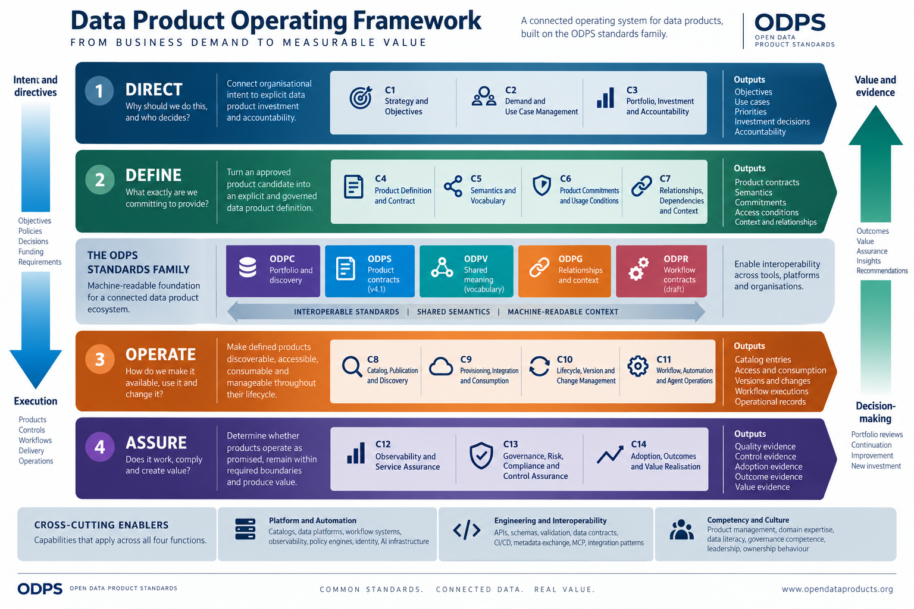

# Data Product Operating Framework

The Data Product Operating Framework defines how organisations direct, define, operate and assure data products from business demand to measurable value.

It sits above the ODPS standards family and explains how the specifications work together as part of an organisational operating model.



## Project scope

This repository is the source project for the Data Product Operating Framework. The repository slug is `framework`; the framework's published name remains **Data Product Operating Framework**.

The framework is:

- an implementation-neutral operating model
- a connection between organisational decision-making and data product execution
- a structure for evidence, assessment and measurable value
- guidance for using the ODPS standards family together

The framework is not:

- a replacement for an ODPS-family specification
- a data platform or catalog implementation
- evidence that a specific organisation or product conforms

## Core structure

The framework contains four functions and fourteen capabilities:

1. **DIRECT** — Why should we do this, and who decides?
2. **DEFINE** — What exactly are we committing to provide?
3. **OPERATE** — How do we make it available, use it and change it?
4. **ASSURE** — Does it work, comply and create value?

The core rule is:

> Intent and directives flow toward execution. Evidence and value flow toward decision-making.

## Repository structure

- `framework-core.md` — stable framework definition
- `capabilities/` — detailed capability references
- `assessment-standard.md` — maturity model and assessment logic
- `implementation-playbook.md` — implementation guidance
- `glossary.md` — formal terminology
- `profiles/` — context-specific framework profiles
- `crosswalks/` — mappings to other frameworks and standards
- `assets/` — framework diagrams and other publication assets
- `publication/` — shared HTML and PDF templates, styles and publication manifest
- `scripts/build_publication.mjs` — deterministic Markdown-to-HTML publication build
- `scripts/render_pdf.mjs` — PDF rendering from the generated print publication
- `VERSIONING.md` — versioning and release approach
- `GOVERNANCE.md` — project authority and change process
- `CONTRIBUTING.md` — contribution requirements
- `CHANGELOG.md` — notable framework changes
- `scripts/validate_repository.py` — repository integrity checks

## Start here

1. Read the [Framework Core](framework-core.md).
2. Use the detailed references for [DIRECT](capabilities/direct.md), [DEFINE](capabilities/define.md), [OPERATE](capabilities/operate.md) and [ASSURE](capabilities/assure.md).
3. Apply the [Implementation Playbook](implementation-playbook.md).
4. Evaluate capabilities with the [Assessment Standard](assessment-standard.md).
5. Use the [Glossary](glossary.md) for the framework's formal terminology.

## ODPS standards family

The framework uses the ODPS standards family as its machine-readable foundation:

- **ODPS** — data product contracts
- **ODPC** — portfolio and discovery
- **ODPV** — shared vocabulary
- **ODPG** — relationships and context
- **ODPR** — workflow contracts

The framework itself is not another ODPS-family specification. It defines how the standards are used together in an operating model.

## Publication model

Markdown is the source of truth.

The responsive standalone HTML publication and the PDF are generated from the same ordered Markdown sources in `publication/manifest.json`. The HTML uses a dark, collapsible chapter navigation and a light reading area; below desktop width, navigation becomes an accessible hamburger-controlled drawer.

Generated publication files should not be manually edited.

Install dependencies and run the complete publication pipeline:

```sh
npm ci
npm run publication
```

The pipeline writes:

- `dist/index.html` — standalone responsive framework publication
- `dist/downloads/data-product-operating-framework-v0.1.0.pdf` — PDF served by the website
- `output/pdf/data-product-operating-framework-v0.1.0.pdf` — canonical local PDF artifact

For HTML-only validation during editing:

```sh
npm test
```

GitHub Actions builds, validates and deploys `dist/` to GitHub Pages after changes reach `main`. Under the Open Data Product Initiative custom domain, the intended project URL is `https://opendataproducts.org/framework/`.

## Contributing

See [CONTRIBUTING.md](CONTRIBUTING.md) for the contribution workflow and [GOVERNANCE.md](GOVERNANCE.md) for project decision-making.

## License

Except where otherwise noted, the framework documentation and publication assets are licensed under the [Creative Commons Attribution 4.0 International License](LICENSE).

When sharing or adapting the material, credit the **Data Product Operating Framework contributors**, link to the source repository and license, and indicate whether changes were made. Third-party material remains subject to its original terms and should be identified separately.

## Status

This repository currently contains the draft Core v0.1 and initial capability definitions. Draft material is open for review but must not be represented as a released or adopted framework version.
