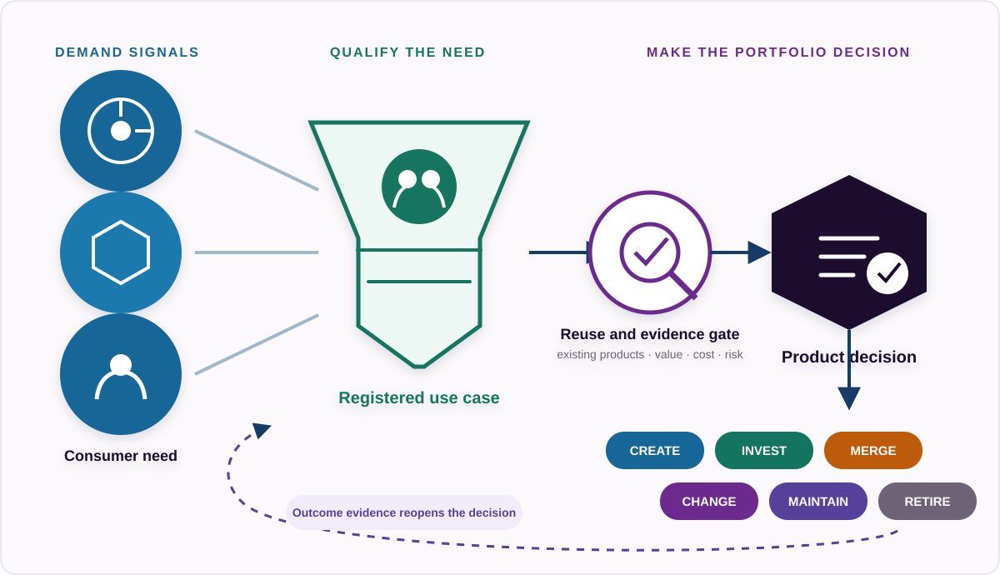

# DIRECT

## Purpose

DIRECT ensures that data products exist for an explicit reason, serve identifiable demand, have accountable ownership, and receive investment based on expected value.

It creates the governance chain between organisational intent and individual data products.

## C1. Strategy and Objectives

### Purpose

Ensure data product activity is anchored in explicit organisational objectives and measurable outcomes.

### Operating intent

Strategy becomes operational only when it changes a decision. An objective should therefore be specific enough to influence which demand is accepted, which product is funded, what outcome is expected and when investment should be reconsidered. Broad statements such as “become data driven” may express direction, but they do not provide a sufficient basis for prioritisation or assurance.

The objective record should preserve both accountability and evaluation context: the owner, intended beneficiaries, baseline, target, time horizon, constraints and assumptions. Measures may change as the organisation learns, but the reason for the change and the approving authority should remain traceable. This prevents later outcome reporting from being detached from the decision that originally justified the work.

### Expected outcomes

- Data product investments connect to recognised organisational objectives.
- Objectives have accountable owners.
- Expected outcomes are measurable.
- Strategic priorities influence portfolio decisions.
- Evidence from data products feeds back into strategic decision-making.

### Practices

1. Establish data product direction.
2. Register relevant objectives.
3. Assign objective ownership.
4. Define outcome measures.
5. Establish strategic guardrails.
6. Review strategic alignment.

### Evidence

- approved objective
- named accountable owner
- defined KPI or outcome measure
- strategic priority decision
- relevant policy or mandate
- traceable downstream relationships

### Example measures

- percentage of active products linked to at least one approved use case
- percentage of funded initiatives traceable to an organisational objective
- percentage of objectives with defined outcome measures
- number of products without identifiable strategic or demand justification

### Assurance questions

- Can the objective owner explain which product investments the objective has changed?
- Is the expected outcome distinguishable from an activity, deliverable or technology deployment?
- Is there a baseline or an explicit explanation of why one cannot yet be established?
- Can decision-makers see when evidence contradicts the original strategic assumption?

## C2. Demand and Use Case Management

### Purpose

Translate organisational objectives and real consumer needs into explicit demand for data.

### Operating intent

Demand management is the point where an organisational ambition becomes a testable statement of need. A use case should identify the consumer, the decision or process to be improved, the present limitation, the expected change and the evidence that would indicate success. It should not prescribe a new product before existing products and non-product alternatives have been evaluated.

Separating use cases from products makes reuse visible. If several use cases require the same stable capability, that is evidence for a reusable product. If one proposed product bundles unrelated demand, the portfolio may need to split it. The use-case record should remain valid even if the eventual product, interface or implementation platform changes.

### Core rule

`Objective ≠ Use Case ≠ Data Product`

One objective can generate many use cases.

One use case can require many data products.

One data product can support many use cases.

### Practices

1. Capture demand.
2. Identify the consumer.
3. Define the problem.
4. Define the expected outcome.
5. Define evidence needs.
6. Search existing products.
7. Identify capability gaps.
8. Qualify and prioritise demand.
9. Connect demand to products.

### Evidence

- registered use case
- named use-case owner
- defined consumer
- problem statement
- expected outcome
- success measure
- evaluation of existing products
- prioritisation decision
- traceable objective relationship
- traceable product relationship

### Example measures

- percentage of product initiatives originating from registered demand
- percentage of use cases linked to measurable outcomes
- percentage of new demand evaluated against existing products first
- product reuse across multiple use cases
- duplicate product requests avoided
- time from accepted demand to product decision

### Assurance questions

- Is the consumer named or represented by an accountable role rather than an abstract audience?
- Does the use case describe a decision, process or obligation that can change?
- Were existing products evaluated before a new product candidate was approved?
- Are rejected, deferred and consolidated requests retained with their decision rationale?

## C3. Portfolio, Investment and Accountability

### Purpose

Convert qualified demand into explicit decisions about data product investment, ownership and lifecycle.

### Operating intent

The portfolio is a decision system, not merely an inventory. It should expose competing demands, product overlap, dependency concentration, total operating cost and the evidence used to continue or stop investment. A catalog can list products, but only accountable portfolio governance can decide whether they should exist.

Accountability should distinguish the person who owns the product outcome from people who provide engineering, governance or platform services. Funding should include the continuing cost of operating, assuring and eventually retiring the product—not only initial delivery. Portfolio review should occur on a defined cadence and when material triggers arise, such as loss of active demand, repeated commitment failures, major dependency changes or a superior reusable product becoming available.

Decision records should state the options considered, evidence available, assumptions made and authority used. This allows later reviewers to distinguish a poor decision from a reasonable decision made with incomplete information.

### Practices

1. Maintain the product portfolio.
2. Evaluate product candidates.
3. Assign accountable ownership.
4. Make investment decisions.
5. Establish funding.
6. Evaluate reuse and portfolio overlap.
7. Manage dependencies.
8. Review portfolio performance.
9. Make lifecycle decisions.

### Lifecycle decisions

- create
- invest
- expand
- maintain
- change
- merge
- reduce
- retire

### Evidence

- approved product decision
- accountable owner
- investment rationale
- funding source
- portfolio priority
- lifecycle state
- dependency record
- review history
- usage evidence
- outcome evidence
- retirement or continuation decision

### Example measures

- percentage of active products with accountable owners
- percentage with identified operating funding
- percentage linked to active demand
- portfolio spend by strategic objective
- reuse rate
- overlapping products
- products with no measurable consumption
- products with no active use cases
- products reviewed within policy period

### Assurance questions

- Can the accountable owner make or escalate lifecycle and commitment decisions?
- Does investment cover continuing operation, assurance, change and retirement?
- Can the portfolio identify products with overlapping propositions or concentrated dependencies?
- Are continuation and retirement decisions supported by outcome evidence rather than usage alone?

## DIRECT control loop

`Strategy and Objectives → Demand and Use Cases → Portfolio and Investment → DEFINE → OPERATE → ASSURE → Portfolio Review → Strategy Review`

DIRECT remains active after approval. Evidence from ASSURE may invalidate an objective assumption, reveal a different consumer need or show that continued investment is no longer justified. The control loop therefore needs explicit review dates, trigger events and decision owners rather than relying on informal escalation.

## Evidence basis and external references

The framework requirements above are Open Data Product Initiative operating-model decisions. The following external sources provide supporting context rather than additional conformance requirements:

- **`nist-csf-2.0`** — [NIST Cybersecurity Framework 2.0](https://doi.org/10.6028/NIST.CSWP.29) uses outcome-oriented guidance and explicitly allows implementation to vary by organisation and use case. That supports separating desired outcomes from prescribed implementation activity.
- **`nist-privacy-framework-1.0`** — [NIST Privacy Framework 1.0](https://www.nist.gov/privacy-framework/privacy-framework) connects enterprise risk management with cross-functional accountability and decision-making. It informs the treatment of ownership, context and risk without making the privacy framework mandatory for all data products.
- **`nist-ai-rmf-1.0`** — [NIST AI Risk Management Framework 1.0](https://doi.org/10.6028/NIST.AI.100-1) connects governance activity to organisational priorities and risk tolerance. It is relevant when AI is in scope but does not make AI-specific governance a Core dependency.
- **`edm-council-dcam`** — [EDM Council DCAM](https://edmcouncil.org/frameworks/dcam/) is retained as a professional-framework comparison point for enterprise capability and assessment coverage. Its licensed content is not reproduced and it does not define framework conformance.
