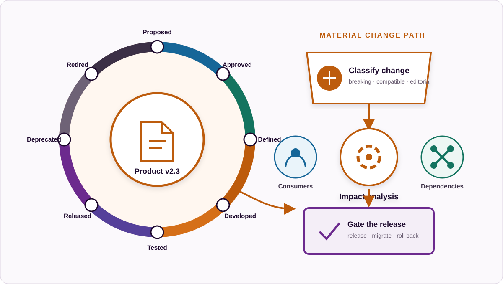

# OPERATE

## Purpose

OPERATE turns defined data products into available, consumable and managed services.

## Operating principle

Declaration and execution are separate responsibilities.

`DECLARE → EXECUTE → EVIDENCE`

The ODPS standards family declares portable contracts.

Operational platforms execute them.

Runtime systems produce evidence.

## C8. Catalog, Publication and Discovery

### Purpose

Make governed data products and surrounding business context discoverable by people, applications and automated systems, including AI agents where used.

### Operating intent

Publication should help a consumer decide whether a product is suitable, not merely confirm that a record exists. Discovery information therefore needs product identity, proposition, provider, lifecycle state, version, relevant semantics, access path, commitments, usage conditions and relationships to demand or alternatives. Search relevance and business language matter alongside technical metadata.

The catalog is an index and presentation surface, not necessarily the authority for every field. It should preserve resolvable links to authoritative product, vocabulary, graph and policy artifacts and disclose when indexed information was last synchronized. Federation must not hide conflicting identifiers, stale records or different visibility rules.

Machine discovery requires structured metadata and a stable interface. Free-text catalog pages may help people, but automated consumers should not have to infer lifecycle state, access conditions or compatibility from prose alone.

### Practices

1. Register the product.
2. Maintain authoritative references.
3. Publish portfolio context.
4. Apply visibility controls.
5. Support business-context search.
6. Support machine discovery.
7. Federate where required.
8. Validate catalog integrity.
9. Manage catalog lifecycle.

### Primary standard

ODPC.

### Evidence

- valid ODPC catalog
- resolvable ProductReference
- publication record
- catalog validation result
- search index record
- visibility configuration
- broken-reference report

### Assurance questions

- Can intended consumers discover a product using their business problem and terminology?
- Can they identify current, deprecated and unsuitable products before requesting access?
- Does each catalog record resolve to authoritative artifacts and disclose synchronization state?
- Can machines retrieve structured discovery metadata without screen scraping?

## C9. Provisioning, Integration and Consumption

### Purpose

Turn a defined product interface into controlled consumer access.

### Operating intent

Provisioning begins with an identified consumer and an intended use, then evaluates entitlement against the product's access and usage conditions. Approval is one possible control; it should not be added where an automatic policy decision is sufficient, nor removed where accountable judgement or risk acceptance is required.

Access is not complete when credentials are issued. The consumer needs the interface version, endpoint or delivery location, authentication method, semantic context, operating limits, support path and a successful connectivity or acceptance check. These details should be versioned where a change could affect consumption.

Consumption evidence should associate activity with the product, version and consumer identity at an appropriate level of granularity. Privacy, security and proportionality constraints still apply: the framework does not require invasive tracking of individual behaviour to establish product adoption.

### Practices

1. Resolve the access contract.
2. Identify the consumer.
3. Evaluate entitlement.
4. Provision access.
5. Provide implementation context.
6. Validate connectivity.
7. Associate consumption with the product.
8. Manage consumer changes.
9. Revoke access.
10. Support automated consumers where used.

### Primary standard

ODPS.

### Supporting standard

ODPR for implementation handoff and onboarding workflows.

### Evidence

- access request
- approval where required
- provisioning record
- entitlement record
- connectivity test
- product version consumed
- subscription record
- revocation record
- consumption event

### Assurance questions

- Can every active entitlement be traced to a consumer, product version and applicable condition?
- Is the provisioning decision reproducible from policy and approval evidence?
- Does onboarding verify usable access rather than merely issuing credentials?
- Can access be changed or revoked when the consumer, purpose or product state changes?

## C10. Lifecycle, Version and Change Management

### Purpose

Control the evolution of a data product from initial development through production, change, deprecation and retirement.

### Operating intent

Versioning communicates consumer-relevant meaning. An organisation should define what constitutes a breaking, compatible and editorial change for its product types and apply that classification consistently. A changed implementation does not always require a new public contract version, while a changed meaning, interface, commitment or condition often does.

Impact analysis should use known consumers, dependencies, workflows, controls and value paths rather than relying only on the delivery team’s judgement. The change record should identify the prior and proposed state, affected relationships, validation evidence, decision authority, release timing and recovery approach.

Deprecation is a managed period, not a label applied shortly before shutdown. Consumers need a supported alternative or explicit exception path, migration expectations and an end date. Retirement should revoke access, close or transfer obligations, update discovery records and retain enough evidence to explain the decision later.

### Practices

1. Maintain lifecycle state.
2. Version the product.
3. Classify changes.
4. Analyse impact.
5. Validate the change.
6. Apply change gates.
7. Release the change.
8. Communicate change.
9. Deprecate safely.
10. Retire products.

### Lifecycle baseline

- announcement
- draft
- development
- testing
- acceptance
- production
- sunset
- retired

### Evidence

- previous product version
- new product version
- version difference
- change classification
- impact analysis
- validation results
- gate results
- approval
- publication result
- consumer notification
- rollback or remediation record where required

### Assurance questions

- Are change classes defined from the consumer's perspective?
- Can the organisation identify affected consumers and downstream dependencies before release?
- Are supported, deprecated and retired versions unambiguous in both contract and runtime state?
- Does retirement close access, obligations, catalog records and operational monitoring deliberately?

## C11. Workflow, Automation and Agent Operations

### Purpose

Make repeatable data product work explicit, portable, bounded and reviewable.

### Operating intent

A workflow contract should state the intended outcome, authoritative inputs, ordered activities, decision points, expected outputs, validation gates, accountable roles and evidence to retain. It should remain distinguishable from a specific execution engine so the organisation can review or move the procedure without losing its meaning.

Human-led, application-led and agent-assisted execution are all valid Core implementations. Automation is appropriate when inputs, rules, permissions and failure handling are explicit. Where judgement or risk acceptance is material, the workflow should identify the human decision and the information needed to make it rather than disguising the decision as an automated step.

Execution records should identify the workflow version, input versions, actor or system identities, decisions, exceptions, outputs and final status. A successful technical run does not by itself show that the business outcome was correct; ASSURE evaluates service, control and outcome evidence separately.

### Practices

1. Identify repeatable work.
2. Declare workflow intent.
3. Declare inputs.
4. Declare ordered activities.
5. Declare outputs.
6. Define gates.
7. Define human review.
8. Bound automated and agent work where used.
9. Separate contract from runtime.
10. Record execution evidence.
11. Manage workflow versions.
12. Reuse proven workflows.

### Primary standard

ODPR.

### Operational patterns

- delivery flows
- product handoff flows
- machine discovery flows
- trigger-based flows

### Evidence

- ODPR recipe
- recipe version
- input manifest
- execution record
- validation result
- gate result
- human review decision
- output manifest
- exception record
- run outcome

### Assurance questions

- Is the portable workflow intent separable from the selected orchestration platform?
- Are inputs, permissions, gates, stopping conditions and exception paths explicit enough to review?
- Can each execution be tied to the workflow and artifact versions actually used?
- Does automation preserve accountable decisions rather than merely remove visible human steps?

## Declared state versus observed state

OPERATE introduces a formal comparison between:

- what the product contract or workflow says should happen
- what operational systems show happened

This difference becomes evidence for ASSURE.

OPERATE should preserve both sides of the comparison. Updating a declaration to match a failure can erase the signal; retaining observations without the applicable declaration removes the evaluation basis. Version and time therefore matter for contracts, policies, workflows and evidence.

## Evidence basis and external references

The framework requirements above remain Open Data Product Initiative decisions. These sources provide supporting patterns:

- **`w3c-dcat-3`** — [W3C Data Catalog Vocabulary 3](https://www.w3.org/TR/vocab-dcat-3/) provides portable catalog, dataset, distribution and data-service structures as well as catalog-record lifecycle metadata. It informs federation and discovery but does not replace ODPC or ODPS.
- **`wilkinson-fair-principles-2016`** — [FAIR Guiding Principles](https://doi.org/10.1038/sdata.2016.18) support persistent identifiers, rich metadata and machine-actionable discovery while preserving the distinction between accessibility and unrestricted access.
- **`w3c-prov-o`** — [W3C PROV-O](https://www.w3.org/TR/prov-o/) provides a general model for entities, activities, agents and derivation. It informs workflow and execution provenance without requiring a particular runtime platform.
- **`nist-sp-800-53r5`** — [NIST SP 800-53 Rev. 5](https://csrc.nist.gov/pubs/sp/800/53/r5/upd1/final) contains established control patterns for access, configuration, change, monitoring and evidence. Organisations should select applicable controls rather than treating the catalog as a universal checklist.
- **`nist-ai-rmf-1.0`** and **`nist-ai-600-1-genai-profile`** — [NIST AI RMF 1.0](https://doi.org/10.6028/NIST.AI.100-1) and its [Generative AI Profile](https://doi.org/10.6028/NIST.AI.600-1) inform bounded AI operations, inventory, measurement and oversight where AI is used. They do not make AI or agents a Core requirement.
