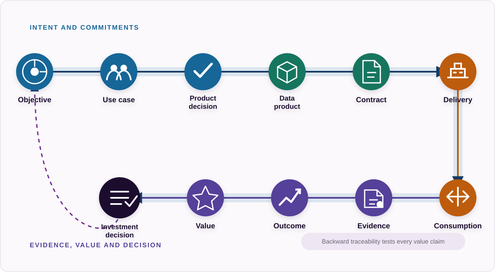
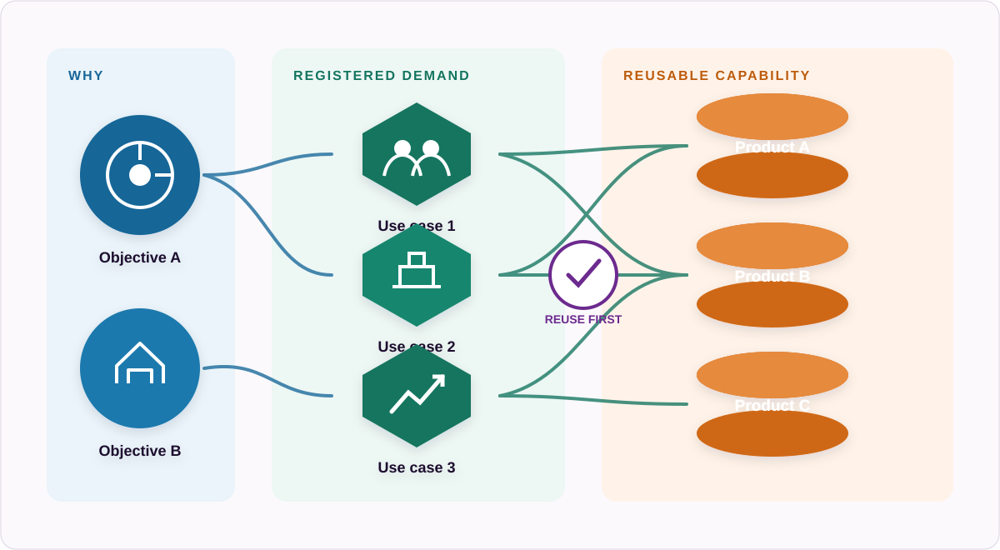
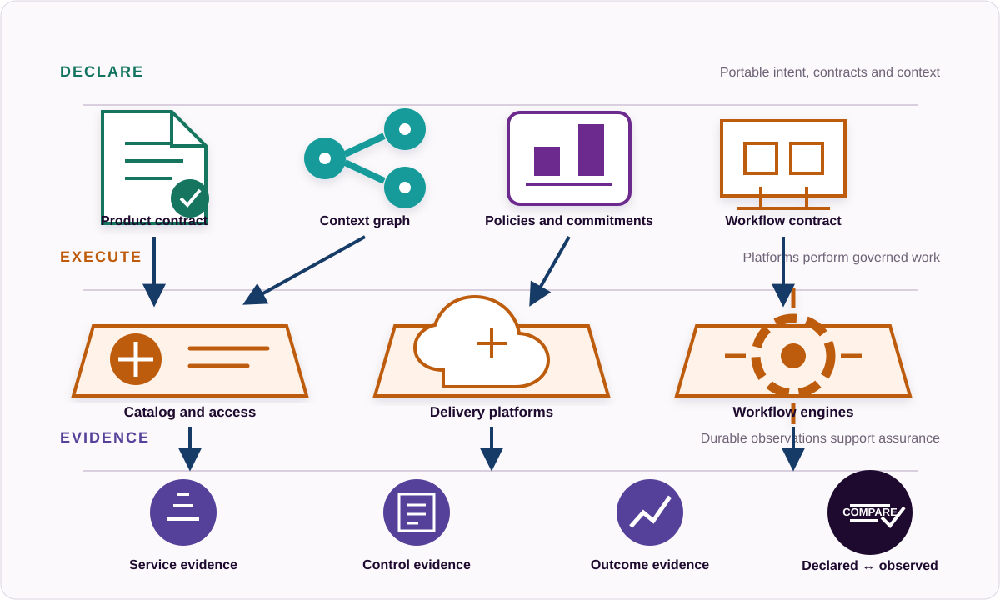
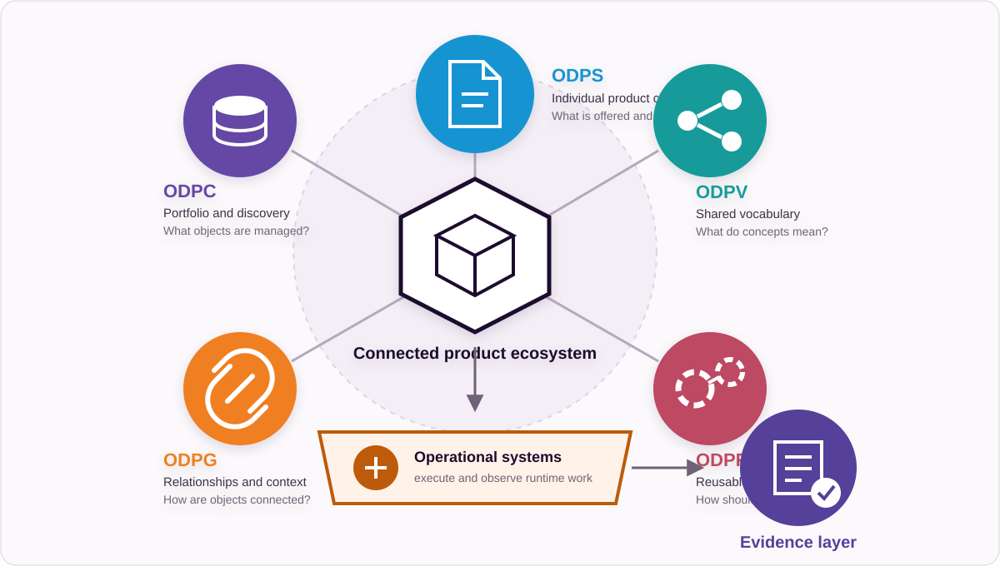

# Data Product Operating Framework Core

## 1. Purpose

The Data Product Operating Framework Core is a universal, vendor-neutral and technology-neutral operating model for managing data products from business demand to measurable value.

It provides a common operating structure connecting:

- business objectives
- use cases and demand
- investment decisions
- data products
- machine-readable product contracts
- semantics
- governance requirements
- delivery and consumption
- lifecycle management
- operational evidence
- business outcomes
- value

The Core works for organisations operating with:

- human users
- traditional applications
- analytics systems
- data platforms
- automation
- AI systems
- AI agents

The framework does not require organisations to operate AI agents. It provides one common operating model that supports organisations from traditional enterprise data product management through AI-agent-first operations.

The Core remains machine-readable and automation-friendly by design. The ODPS standards family provides the machine-readable standards foundation underneath the framework. The framework is an operating model, not another ODPS-family specification.

The Core defines required operating concerns rather than one mandatory organisational design. A small organisation may combine several accountabilities in one role; a large organisation may distribute them across product, domain, platform, governance and assurance teams. What matters is that the decision rights, practices, artifacts, evidence and outcomes remain explicit and traceable.

Examples and external references explain how a requirement can be implemented. They do not silently create additional Core requirements. Applicable law, regulation, contracts and organisational policy may impose stronger obligations in a particular environment; those obligations should be represented through the relevant profile, product context and control model.

## 2. The four questions

### DIRECT

Why should we do this, and who decides?

### DEFINE

What exactly are we committing to provide?

### OPERATE

How do we make it available, use it and change it?

### ASSURE

Does it work, comply and create value?

## 3. Core rule

Intent and directives flow toward execution.

Evidence and value flow toward decision-making.

Forward traceability:

`Objective → Use Case → Product Decision → Data Product → Product Contract → Delivery → Consumption → Evidence → Outcome → Value → Investment Decision`

Backward traceability:

`Investment Decision → Value → Outcome → Evidence → Consumption → Delivery → Product Contract → Data Product → Product Decision → Use Case → Objective`

The same identifiers and relationships should make this chain traversable in both directions.

## 4. Core foundation principles

### F1. Start from demand

The existence of data does not justify creating a data product.

Investment starts from:

- an objective
- a problem
- a use case
- an obligation
- a consumer need

### F2. Separate use cases from data products

A use case explains why data is needed.

A data product defines a reusable capability provided to consumers.

The relationship is many-to-many:

`Objective → Use Case → Data Product`

One use case can require many products, and one product can support many use cases.

### F3. Data products are contracts

A managed data product must have an authoritative definition.

The contract describes:

- what the product is
- who provides it
- what it provides
- how it is accessed
- what it means
- what it promises
- what conditions apply
- how it changes

### F4. Machine-readable by default, human-readable by presentation

The authoritative representation should favour machine-readable structures.

Human-readable views such as web pages, PDF documents, catalog pages, dashboards and reports should derive from the underlying structured artifacts where practical.

ODPS is machine-readable by design. Human-readable documentation and interfaces should increasingly be generated from the same underlying product artifacts used by software and AI agents.

### F5. Preserve business context

Business context should survive the transition from strategy into technical implementation.

A product should remain connected to:

- objectives
- use cases
- consumers
- KPIs
- owners
- dependencies
- policies

### F6. Separate declaration from execution

The ODPS standards family declares portable contracts and context.

Operational platforms execute work.

Runtime systems produce evidence.

`DECLARE → EXECUTE → EVIDENCE`

### F7. Treat evidence as a first-class object

Claims must be backed by evidence.

- A quality target is not evidence of quality.
- An SLA is not evidence of service performance.
- A policy reference is not evidence that a control worked.
- A use case is not evidence of adoption.
- An objective is not evidence of value.

### F8. Separate declared state from observed state

Declared state describes what should happen.

Observed state describes what runtime evidence shows happened.

The difference between the two is a governance signal.

### F9. Measure value beyond usage

Usage is evidence of activity. It is not automatically evidence of value.

The framework preserves the chain:

`Discovery → Access → Adoption → Consumption → Use-case outcome → Organisational value`

### F10. Govern the full lifecycle

Products should be deliberately:

- proposed
- approved
- defined
- developed
- tested
- released
- changed
- deprecated
- retired

### F11. Design for interoperability

The framework must work across:

- catalogs
- data platforms
- cloud environments
- governance tools
- workflow engines
- AI systems
- organisational structures

No single implementation platform is required.

### F12. Design for both people and machines

The same underlying product context should serve:

- human consumers
- applications
- developer tools
- governance systems
- AI agents

Different interfaces can present the information differently. The underlying meaning should remain consistent.

### F13. Automation does not equal maturity

A poor process does not become mature because it is automated.

Maturity continues to be assessed through:

- Accountability
- Practice
- Evidence
- Outcome

### F14. One traceability chain

The framework preserves end-to-end traceability:

`Objective → Use Case → Product Decision → Data Product → Product Contract → Delivery → Consumption → Evidence → Outcome → Value → Investment Decision`

The chain works in both directions.

### F15. One Core, multiple profiles

The Core defines universal capabilities.

Profiles strengthen or specialise those capabilities for specific operating environments. Profiles must not redefine the Core.

## 5. Framework structure

The universal Core contains:

- 4 functions
- 14 capabilities
- common principles
- common terminology
- a common traceability model
- a common evidence model
- a common assessment model
- a common conformance model
- practices within each capability
- artifacts produced by those practices
- evidence demonstrating execution and outcomes
- measures evaluating performance

The Core is the map, not the complete implementation guide. The [capability reference](capabilities/reference/README.md) explains the work, evidence and assessment levels for C1-C14; the [implementation playbook](implementation-playbook.md) explains how to establish the work in practice; the [examples](examples/customer-360/README.md) show a complete chain.

Profiles adapt this shared foundation to specific operating environments. They are not separate frameworks.

## 6. Function 1: DIRECT

Purpose: connect organisational intent to explicit data product investment and accountability.

### C1. Strategy and Objectives

Connect data product activity to explicit organisational objectives, mandates and measurable outcomes.

### C2. Demand and Use Case Management

Capture, qualify and prioritise the problems, decisions and consumer needs creating demand for data.

### C3. Portfolio, Investment and Accountability

Decide which products deserve investment, assign accountability, manage funding and govern portfolio lifecycle decisions.

DIRECT produces:

- objectives
- use cases
- priorities
- investment decisions
- accountability
- product candidates
- success measures

## 7. Function 2: DEFINE

Purpose: turn an approved product candidate into an explicit and governed data product definition.

### C4. Product Definition and Contract

Establish the authoritative machine-readable definition of the data product.

### C5. Semantics and Vocabulary

Establish shared meaning for important concepts and terminology, using machine-readable representations where practical.

### C6. Product Commitments and Usage Conditions

Define measurable quality, service, access, legal, privacy, security and commercial conditions where applicable.

### C7. Relationships, Dependencies and Context

Connect products to objectives, use cases, KPIs, policies, systems, products and other relevant context.

DEFINE produces:

- product contracts
- product identities
- semantics
- quality commitments
- service commitments
- access conditions
- governance context
- relationships
- dependencies

## 8. Function 3: OPERATE

Purpose: make defined products discoverable, accessible, consumable and manageable throughout their operational lifecycle.

### C8. Catalog, Publication and Discovery

Publish and organise governed products and business context so people, applications and automated systems can find suitable products.

### C9. Provisioning, Integration and Consumption

Manage the controlled path from product discovery to usable consumer access and ongoing consumption.

### C10. Lifecycle, Version and Change Management

Control how products move through lifecycle states and how versions and changes affect consumers.

### C11. Workflow, Automation and Agent Operations

Define repeatable and reviewable operating procedures for people, software systems, automation and AI agents where used.

OPERATE produces:

- catalog entries
- access
- subscriptions
- integrations
- versions
- changes
- releases
- workflow executions
- approvals
- operational records

## 9. Function 4: ASSURE

Purpose: determine whether products operate as promised, remain within required boundaries and produce sufficient value.

### C12. Observability and Service Assurance

Compare actual product quality and service performance with declared commitments.

### C13. Governance, Risk, Compliance and Control Assurance

Determine whether applicable policies and controls operate effectively and produce sufficient evidence.

### C14. Adoption, Outcomes and Value Realisation

Determine whether intended consumers use products and whether that consumption contributes to expected outcomes and value.

ASSURE produces:

- quality evidence
- service evidence
- control evidence
- risk findings
- adoption evidence
- outcome evidence
- value evidence
- investment recommendations

## 10. Cross-cutting enablers

### E1. Platform and Automation

Catalogs, data platforms, workflow systems, observability systems, policy engines, identity systems, developer platforms and AI infrastructure.

### E2. Engineering and Interoperability

APIs, schemas, validation, data contracts, CI/CD, metadata exchange, MCP and integration patterns.

### E3. Competency and Culture

Product management, domain expertise, data literacy, governance competence, engineering capability, leadership, ownership behaviour and consumer orientation.

## 11. Authority model

The Core uses the following separation of authority. These responsibilities are complementary and must not be collapsed into a new framework specification.

### ODPS

Authoritative machine-readable representation of an individual data product contract.

It answers:

- What is this product?
- What does the provider offer?
- What commitments and conditions apply?

### ODPC

Authoritative portable representation of portfolio and discovery objects.

It answers:

- What products, use cases, objectives, signals and related portfolio objects are being managed?

### ODPV

Authoritative shared vocabulary and semantics for the standards family.

It answers:

- What do these concepts mean?

### ODPG

Authoritative portable representation of relationships and context.

It answers:

- How are these objects connected?

### ODPR

Authoritative portable representation of reusable workflow contracts.

It answers:

- How should this type of work happen?

### Operational systems

Responsible for runtime execution and relevant runtime observations.

They answer:

- What happened?

### Evidence layer

Provides durable assurance information that proves what happened.

It answers:

- What proves it?

## 12. Local context and shared context

Relevant context can appear inside an individual product contract even when a canonical portfolio object exists elsewhere.

The distinction is:

- local context makes the product independently understandable
- shared context creates reusable organisational objects
- relationships preserve alignment between them

For example:

- ODPS can state which objective an individual product supports
- ODPC can represent that Business Objective as a reusable portfolio object
- ODPG connects the product and objective explicitly

This is intentional contextual redundancy, provided identifiers and relationships preserve consistency.

## 13. Declared state and observed state

### Declared state

What the product contract, policy or workflow states should happen.

### Observed state

What runtime evidence shows happened.

Example:

Declared quality:

`Completeness ≥ 98%`

Observed quality:

`Completeness = 94.7%`

Assurance result:

`Commitment not met`

The difference between declared and observed state is a first-class governance signal.

## 14. Evidence model

Evidence is information retained so that a material claim, execution or decision can be examined. It should identify what it concerns, where it came from, when it was produced, which version and scope applied, how it was generated and who or what is accountable for it. The required strength and retention period depend on the consequence of the decision being supported.

Evidence may be a structured event, measurement, validation report, signed approval, decision record, test result or other durable artifact. A screenshot or narrative may be sufficient for a low-risk review but weak for repeatable automated assurance. The framework therefore specifies evidence purpose and traceability while allowing implementation profiles and organisations to define proportionate formats and controls.

### Directive evidence

Objectives, priorities, policies, funding decisions, portfolio decisions and approvals.

### Definition evidence

Product contracts, vocabulary, commitments, relationships and control definitions.

### Execution evidence

Workflow executions, validations, approvals, deployments, provisioning, versions and changes.

### Operational evidence

Quality observations, service observations, consumption, incidents, control executions and exceptions.

### Outcome evidence

Adoption, use-case performance, KPI changes, cost, benefit, risk reduction, public value and other demonstrated outcomes.

Evidence quality should be evaluated through at least:

- identity — the object, product, control, workflow or decision is unambiguous
- provenance — the producing person, system or activity is known
- time — production time and applicable evaluation period are known
- version — the relevant contract, policy, workflow and implementation versions are known
- method — the collection, calculation or decision method is inspectable
- integrity — material alteration can be detected or governed
- scope — inclusions, exclusions and applicability are stated
- retention — evidence remains available for the decisions and obligations it supports

More evidence is not automatically better evidence. Collection should be proportionate, privacy-aware and connected to a decision or assurance need.

## 15. Value model

The framework distinguishes six value classes:

1. Financial value
2. Operational value
3. Decision value
4. Risk value
5. Compliance value
6. Public value

The framework distinguishes four attribution levels:

1. Direct attribution
2. Contribution
3. Enablement
4. Mandatory value

Value claims should state the baseline or counterfactual, measurement period, cost boundary, assumptions and attribution method. Financial conversion is useful only when credible; operational, decision, risk, compliance and public value may require different units and decision criteria.

The value model is designed for investment decisions rather than promotional reporting. Uncertainty, negative outcomes and costs should remain visible. A product may be necessary despite weak direct financial attribution, or widely used while contributing little to the outcome that justified it.

## 16. Four assurance views

### Service Health

Does the product perform as promised?

### Control Health

Does it operate within required governance boundaries?

### Adoption Health

Are intended consumers using it?

### Value Health

Are intended outcomes being achieved?

These views should not be collapsed into one opaque score.

## 17. Capability assessment

Each capability is evaluated independently.

- Level 0: Absent
- Level 1: Emerging
- Level 2: Defined
- Level 3: Operational
- Level 4: Measured
- Level 5: Adaptive

Assessment considers four dimensions:

- Accountability
- Practice
- Evidence
- Outcome

## 18. Framework profiles

The Core remains context-neutral.

The profile architecture is:

`Data Product Operating Framework Core → Enterprise Data Product Profile → AI-Agent-First Data Product Profile`

The [Enterprise Data Product Profile](profiles/enterprise-data-product-profile.md) provides the baseline implementation profile for organisations managing data products through conventional enterprise systems and human-led operating models.

The [AI-Agent-First Data Product Profile](profiles/ai-agent-first-data-product-profile.md) extends the Core with stronger requirements for environments where AI agents directly discover, interpret, access, combine or act on data products.

Profiles may:

- extend Core requirements
- identify stronger practices
- identify required evidence
- identify mandatory machine-readable artifacts
- identify stronger control requirements
- define context-specific assessment expectations

Profiles must not:

- duplicate the entire framework
- rename Core capabilities
- create separate maturity models
- fork Core terminology
- redefine ODPS-family standards

Each profile uses the common C1-C14 capability model and the common assessment dimensions of Accountability, Practice, Evidence and Outcome.

## 19. Framework conformance

The framework distinguishes three forms of conformance:

### Artifact conformance

A machine-readable artifact complies with the applicable specification.

### Practice conformance

An organisation follows the required operating practices.

### Capability conformance

Evidence demonstrates that the capability operates and achieves the required outcomes.

Having a valid ODPS file does not mean the organisation has mature data product management.

It means one important artifact conforms to the standard.

## 20. Core traceability test

For any operational data product, the organisation should be able to answer:

- What is it?
- Who is accountable for it?
- Why does it exist?
- Which use cases depend on it?
- Which objectives do those use cases support?
- Who approved its investment?
- Which version is running?
- What does it promise?
- How is it accessed?
- Who consumes it?
- What depends on it?
- Which policies apply?
- Which controls protect it?
- Which workflows operate it?
- Did those controls execute?
- Is it meeting its quality commitments?
- Is it meeting its service commitments?
- What changed recently?
- What incidents affected it?
- Is adoption increasing or declining?
- What outcome was expected?
- What outcome occurred?
- What did the product cost?
- What value did it contribute?
- When was continued investment last reviewed?

## 21. Machine-readable framework objective

Machine-readable by default, human-readable by presentation is a major Core principle.

The objective is that a significant portion of the Core traceability test can be answered from machine-readable artifacts and evidence.

The framework therefore aims toward:

- machine-readable objectives and use cases
- machine-readable data product contracts
- machine-readable semantics
- machine-readable relationships
- machine-readable policies where suitable
- machine-readable workflows
- machine-readable runtime evidence
- machine-readable assurance results
- traceable value

Human-readable web pages, PDF documents, catalog pages, dashboards and reports should derive from the same underlying structured artifacts where practical. Generated views support communication; they do not replace the authoritative artifacts or the normative Markdown sources of this framework repository.

## 22. Evidence-informed design and external references

The Core is an Open Data Product Initiative operating-model design. External sources inform its reasoning and provide implementation patterns, but they do not become framework requirements merely because they are cited. The governed [Framework Evidence Library](https://github.com/Open-Data-Product-Initiative/framework/tree/main/library) records authority, applicability, rights and intended use for each source.

Important supporting sources include:

- **`w3c-dcat-3`** — [W3C Data Catalog Vocabulary 3](https://www.w3.org/TR/vocab-dcat-3/) for interoperable catalog, dataset, service, distribution and relationship patterns
- **`w3c-skos`** — [W3C SKOS](https://www.w3.org/TR/skos-reference/) for concept identity, labels, semantic relationships and vocabulary mappings
- **`w3c-prov-o`** — [W3C PROV-O](https://www.w3.org/TR/prov-o/) for provenance across entities, activities and agents
- **`w3c-dqv`** — [W3C Data Quality Vocabulary](https://www.w3.org/TR/vocab-dqv/) for quality dimensions, metrics, measurements and annotations
- **`w3c-odrl-2.2`** — [W3C ODRL Information Model 2.2](https://www.w3.org/TR/odrl-model/) for expressing permissions, prohibitions, duties and constraints
- **`w3c-shacl`** — [W3C SHACL](https://www.w3.org/TR/shacl/) for machine-readable constraints and validation results
- **`wilkinson-fair-principles-2016`** — [FAIR Guiding Principles](https://doi.org/10.1038/sdata.2016.18) for persistent identity, rich metadata, provenance and machine actionability
- **`nist-csf-2.0`**, **`nist-privacy-framework-1.0`** and **`nist-sp-800-53r5`** — [NIST Cybersecurity Framework 2.0](https://doi.org/10.6028/NIST.CSWP.29), [NIST Privacy Framework 1.0](https://www.nist.gov/privacy-framework/privacy-framework) and [NIST SP 800-53 Rev. 5](https://csrc.nist.gov/pubs/sp/800/53/r5/upd1/final) for risk, control, lifecycle and assurance patterns
- **`nist-ai-rmf-1.0`**, **`nist-ai-600-1-genai-profile`** and **`oecd-ai-principles-2024`** — [NIST AI Risk Management Framework 1.0](https://doi.org/10.6028/NIST.AI.100-1), its [Generative AI Profile](https://doi.org/10.6028/NIST.AI.600-1) and the [OECD AI Principles](https://oecd.ai/en/ai-principles) for AI-specific governance where AI systems or agents are in scope
- **`eu-ai-act-2024-1689`** — [Regulation (EU) 2024/1689](https://eur-lex.europa.eu/eli/reg/2024/1689/oj) as a jurisdiction-specific legal source for applicable AI obligations, not as a universal Core requirement
- **`iso-iec-42001-2023`** and **`edm-council-dcam`** — [ISO/IEC 42001:2023](https://www.iso.org/standard/81230.html) and [EDM Council DCAM](https://edmcouncil.org/frameworks/dcam/) as licensed comparison points; their protected content is not reproduced by this framework

Sources may disagree, address different objects or apply only in particular jurisdictions. Maintainers should cite the primary source, disclose applicability and preserve the framework's authority boundary when proposing changes.

## 23. Positioning statement

The Data Product Operating Framework is an open operating model for managing data products from business demand to measurable value.

It connects strategy, use cases, investment, product contracts, semantics, governance, delivery, lifecycle management and assurance through shared machine-readable context and evidence.

The framework does not require organisations to operate AI agents. It provides one common operating model that supports organisations from traditional enterprise data product management through AI-agent-first operations.

The ODPS standards family provides the interoperable, machine-readable standards foundation underneath the framework.

The framework explains how the parts work together. It is not itself another ODPS-family specification.
