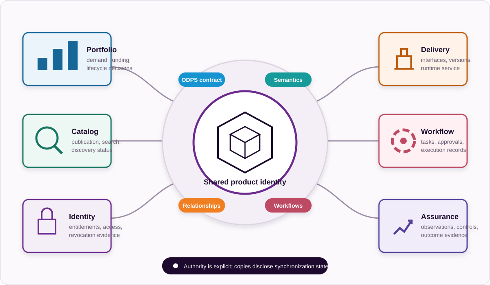

# Enterprise Data Product Profile

## 1. Scope

The Enterprise Data Product Profile provides the baseline implementation profile for organisations managing enterprise data products through conventional enterprise systems and human-led operating models.

It applies the [Data Product Operating Framework Core](../framework-core.md) without redefining its functions, capabilities, terminology, assessment model or conformance model.

Typical environments include:

- data catalogs
- data platforms
- APIs
- analytics systems
- governance systems
- human approval processes
- product managers
- domain owners
- engineers
- business consumers

The profile provides a realistic adoption path for organisations that do not yet operate AI agents extensively. Automation and AI may be used, but neither is required for profile adoption.

## 2. Intended users

This profile is intended for:

- data product managers
- domain and data owners
- portfolio and investment decision-makers
- data governance teams
- platform and catalog teams
- data and software engineers
- risk, compliance and assurance teams
- business consumers

## 3. Assumptions

The profile assumes that:

- accountability remains primarily human-led
- approvals may be manual or workflow-supported
- catalogs and platforms may be federated or heterogeneous
- product information may be distributed across several enterprise systems
- machine-readable artifacts can be adopted incrementally
- existing governance and delivery systems remain operational authorities
- the ODPS standards family supplies portable contracts and context where applicable

The profile does not require replacement of existing platforms. It requires clear authority, portable definitions, traceability and evidence across them.

Distributed implementation is acceptable when authority is explicit. For example, the product contract may be maintained in source control, discovery metadata in a catalog, entitlements in an identity platform and observations in monitoring systems. The organisation should define which system is authoritative for each object, how identifiers connect them and how conflicts or stale copies are detected.

## 4. Core capability requirements

All fourteen Core capabilities apply.

### C1. Strategy and Objectives

Objectives should be explicit, measurable where practical and owned by accountable roles.

At minimum, retain the objective owner, intended outcome, measure or evaluation method, time horizon and approval status. A generic transformation theme is not sufficient justification for every product placed beneath it.

### C2. Demand and Use Case Management

Use cases should be registered, owned and linked to relevant objectives and data products.

The record should identify the consumer, problem or decision, expected change, evidence of success and evaluation of existing products. Registration may begin in an established demand-management tool if stable references connect it to the portfolio and product contract.

### C3. Portfolio, Investment and Accountability

Products should have accountable owners, explicit investment decisions and governed lifecycle decisions.

Portfolio review should consider continuing operating cost, active demand, overlap, dependencies, commitment performance and outcome evidence. Human committees may make the decisions, but their rationale and authority should be retained in a durable record.

### C4. Product Definition and Contract

Active products should have authoritative ODPS definitions with stable identities, responsible providers, versions, interfaces and lifecycle states.

Existing catalog and platform metadata may supply inputs, but the approved ODPS artifact should be identifiable as the portable contract. Human-readable product pages should be generated from or reconciled with that artifact.

### C5. Semantics and Vocabulary

Shared vocabulary is recommended for important cross-domain concepts. Material terms should have consistent definitions across product contracts, catalogs and governance records.

Organisations can start with the concepts that most often cause reconciliation, reporting or policy errors. Stable identifiers and defined ownership are more important than building a comprehensive enterprise ontology before products can operate.

### C6. Product Commitments and Usage Conditions

Relevant quality, service-level, access, usage, policy, privacy, security, licensing and commercial conditions should be explicit.

Conditions should be expressed at the level needed for a consumer and approver to act. Commitments intended for assurance need a metric, scope, evaluation period and method; policy references need an applicability rationale and exception path.

### C7. Relationships, Dependencies and Context

Critical product relationships and dependencies should be represented, including relationships to objectives, use cases, owners, upstream products, downstream consumers and applicable policies.

A spreadsheet or catalog relationship may be an acceptable starting point if identifiers and relationship types are controlled. Critical dependencies should support change-impact review and should not remain solely in architecture diagrams or individual knowledge.

### C8. Catalog, Publication and Discovery

Products should be discoverable through an approved catalog or equivalent governed discovery service.

Discovery should expose proposition, owner, lifecycle state, current version, access path and important conditions in language consumers understand. Federated catalogs should retain authoritative references and synchronization status.

### C9. Provisioning, Integration and Consumption

Access and provisioning should follow defined identity, entitlement, approval and revocation controls.

The implementation should record the consumer, intended use, product version, decision and resulting entitlement. Provisioning is complete only when usable connectivity and relevant conditions have been communicated or tested.

### C10. Lifecycle, Version and Change Management

Versions, lifecycle states, material changes, deprecation and retirement should be managed and communicated to affected consumers.

Change classification should reflect consumer impact. Known consumers and dependencies should be used for impact analysis, migration and notification rather than relying only on general catalog announcements.

### C11. Workflow, Automation and Agent Operations

Critical repeatable workflows should be documented, reviewable and increasingly automated where rules are clear. Human approval should remain where judgement, investment authority or risk acceptance is required.

The baseline can use existing ticketing, workflow or delivery tools when the workflow intent, inputs, decisions, outputs and evidence are explicit. ODPR adoption should improve portability and reuse rather than duplicate an already governed process without purpose.

### C12. Observability and Service Assurance

Important service and quality commitments should be measured, compared with declared commitments and retained as evidence.

Measurements should identify the product and contract version, evaluation period, method and status. Missing observations should not be treated as successful performance.

### C13. Governance, Risk, Compliance and Control Assurance

Applicable policies and controls should be linked to products, operated by accountable roles and supported by evidence.

The profile does not require every enterprise control to be copied into every product. Applicability, ownership, execution evidence, exceptions, findings and remediation should be traceable through the systems already used for governance and assurance.

### C14. Adoption, Outcomes and Value Realisation

Products should be evaluated for discovery, access, adoption, supported use-case outcomes and organisational value rather than usage alone.

Start with a baseline and one outcome measure for each priority use case. Attribution may begin as a documented contribution assessment, provided assumptions, costs and uncertainty are visible to the portfolio decision-maker.

## 5. Mandatory evidence

At minimum, an in-scope operational product should have evidence of:

- an approved objective or registered demand
- one or more registered use cases
- an accountable product owner
- an explicit product decision and lifecycle state
- an authoritative, versioned ODPS product contract
- publication in an approved catalog or equivalent
- defined access and usage conditions
- recorded critical relationships and dependencies
- an access, provisioning or entitlement decision
- a governed release or change decision
- measured quality or service performance where commitments apply
- control execution where policies or obligations apply
- adoption or meaningful consumption
- an outcome or value review

Evidence may remain in existing enterprise systems when it is identifiable, retained and traceable to the product.

## 6. Recommended automation

Organisations should progressively automate:

- schema and contract validation
- catalog publication
- broken-reference and dependency checks
- access request routing
- entitlement verification
- release and change notifications
- quality measurement
- service-level evaluation
- control evidence collection
- lifecycle review reminders
- evidence packaging for assessment

Automation should not replace accountable decisions merely to increase throughput.

## 7. ODPS-family expectations

The profile applies the common authority model:

- **ODPS** represents the individual data product contract.
- **ODPC** represents portfolio and discovery objects.
- **ODPV** represents shared vocabulary and semantics.
- **ODPG** represents relationships and context.
- **ODPR** represents reusable workflow contracts.
- **Operational systems** execute work and provide runtime observations.
- **The evidence layer** preserves what proves what happened.

ODPS definitions are expected for active governed products. The other ODPS-family standards should be adopted where shared portfolio objects, vocabulary, relationship graphs or portable workflows create practical value.

The framework and this profile do not redefine ODPS-family standards.

## 8. Minimum implementation baseline

An organisation meets the minimum implementation baseline when it can demonstrate one complete governed traceability chain containing:

1. an owned objective
2. a registered use case
3. an approved product decision
4. an accountable data product owner
5. a valid, versioned ODPS product contract
6. an approved catalog entry or equivalent discovery record
7. a controlled access path
8. a managed lifecycle state
9. one measured quality or service commitment
10. applicable control evidence
11. an adoption measure
12. an outcome or value review

The chain should be established for a small number of products before it is scaled across the portfolio.

## 9. Assessment expectations

Assessment uses the common [Assessment Standard](../assessment-standard.md), the same C1-C14 capability model and the same four dimensions:

- Accountability
- Practice
- Evidence
- Outcome

Profile requirements add context-specific expectations to those capabilities. They do not create a separate maturity model or allow artifact conformance to substitute for operating evidence.

Assessment should verify that human-led decisions are explicit, machine-readable artifacts are increasing, and operational evidence can be traced back to the relevant product, use case and objective.

## 10. Evidence basis and applicability

This profile translates the Core into a conventional enterprise environment; it does not require conformance to the external sources below. Library sources **`w3c-dcat-3`** and **`wilkinson-fair-principles-2016`**—[W3C DCAT 3](https://www.w3.org/TR/vocab-dcat-3/) and the [FAIR Guiding Principles](https://doi.org/10.1038/sdata.2016.18)—support interoperable, machine-actionable discovery. Sources **`nist-csf-2.0`**, **`nist-privacy-framework-1.0`** and **`nist-sp-800-53r5`**—[NIST Cybersecurity Framework 2.0](https://doi.org/10.6028/NIST.CSWP.29), [NIST Privacy Framework 1.0](https://www.nist.gov/privacy-framework/privacy-framework) and [NIST SP 800-53 Rev. 5](https://csrc.nist.gov/pubs/sp/800/53/r5/upd1/final)—provide patterns for proportionate risk, access, change, control and assurance practices.

Organisations should apply legal, regulatory, contractual and sector-specific requirements through C6 and C13. A requirement that applies in one jurisdiction or product class should not be presented as a universal Enterprise Profile requirement without an explicit profile revision.
